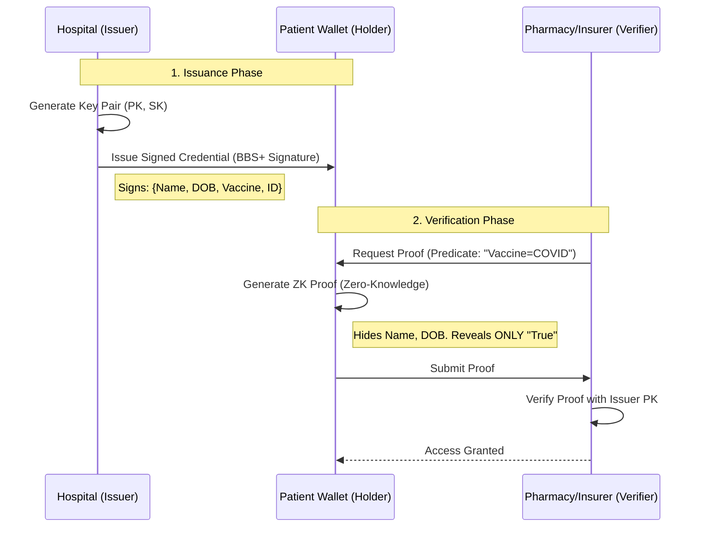

# Project Report: ZKP Multi-System Attribute Verification (MediGuard)

## 1. Executive Summary
**MediGuard** is a privacy-preserving healthcare credential system designed to empower patients with full control over their medical data. By leveraging **Zero-Knowledge Proofs (ZKP)** and **BBS+ Signatures**, MediGuard allows patients to prove specific medical conditions (e.g., "Vaccinated against COVID-19", "Over 21 years old") without revealing their identity, birthdate, or other sensitive details.

The system addresses critical gaps in the Digital Public Infrastructure (DPI) for healthcare by ensuring **Unlinkability** (preventing tracking across providers) and **Selective Disclosure** (sharing only minimum necessary data).

---

## 2. Problem Statement & Motivation
In the traditional healthcare data exchange model:
1.  **Excessive Data Exposure**: To prove age at a pharmacy or liquor store, a user must show a driver's license, revealing their address, full name, and exact birthdate.
2.  **Correlation Risks**: If a user presents their digital ID at a hospital, pharmacy, and insurance provider, these entities can collude to map the user's entire journey, violating privacy.
3.  **Centralized Vulnerability**: Medical data stored in centralized databases is a high-value target for hackers.
4.  **Lack of Portability**: Patients physically carry paper records which are easily forged or lost.

**MediGuard addresses these by decoupling the *Proof* from the *Data*.**

---

## 3. Solution Architecture

### 3.1 High-Level Overview
The system follows the **Verifiable Credentials (VC)** standard model:

### 3.2 Technology Stack
| Component | Technology | Role |
|-----------|------------|------|
| **Frontend** | **Next.js 14** (App Router) | Unified interface for Hospital, Wallet, and Verifier. |
| **PWA** | **next-pwa** | Offline capabilities, installable on mobile/desktop. |
| **State** | **Zustand** | Lightweight client-state management. |
| **Styling** | **TailwindCSS** + **Shadcn UI** | Accessible, responsive, and clean UI components. |
| **Backend** | **FastAPI (Python)** | High-performance async API for cryptographic operations. |
| **Database** | **SQLite** (via **SQLAlchemy**) | Stores Issuer Keys, Audit Logs, and Request Metadata. |
| **Signatures** | **BBS+ (BLS12-381)** | Allows multi-message signing and selective disclosure. |
| **Storage** | **Dexie.js (IndexedDB)** | Encrypted local storage in the browser for credentials. |

---

## 4. Detailed Component Analysis

### 4.1 The Issuer Portal (Hospital)
*   **Role**: Trusted authority (e.g., Apollo Hospital) that issues credentials.
*   **Key Features**:
    *   **Dashboard**: View issuance history and manage keys.
    *   **Issue Credential**: Form to input patient details (Name, ID, Vaccination Type, DOB).
    *   **Cryptographic Signing**: Uses the Hospital's Private Key to sign the structured data.
    *   **QR Generation**: Converts the signed payload into a dense QR code for the patient to scan.

### 4.2 The Patient Wallet (Holder)
*   **Role**: The user agent that holds keys and credentials.
*   **Key Features**:
    *   **Local Storage**: Credentials are stored *only* on the user's device (IndexedDB), never on a server.
    *   **QR Scanner**: Integrated scanner to ingest credentials from hospitals or requests from verifiers.
    *   **Proof Generation**: When a verifier requests proof, the wallet:
        1.  Selects the matching credential.
        2.  Checks the user's consent.
        3.  Generates a ZKP that satisfies the predicate.
    *   **Offline Mode**: Once downloaded, credentials can be viewed and verified (via offline logical checks) without internet.

### 4.3 The Verifier Dashboard (Provider)
*   **Role**: Third-party requesting proof (e.g., Pharmacy checking prescription).
*   **Key Features**:
    *   **Request Builder**: Create dynamic requirements (e.g., `age > 18` OR `vaccine == "Moderna"`).
    *   **Audit Log**: Real-time view of verification attempts. Note: Logs only contain *cryptographic proofs*, not PII.
    *   **Status Polling**: Checks the backend for proof submission status in real-time.

---

## 5. Security & Privacy Analysis

### 5.1 Selective Disclosure
Standard digital signatures (like RSA or ECDSA) sign the entire document. To verify, you must reveal the entire document.
**BBS+ Signatures** allow signing multiple messages (fields) individually.
*   *Scenario*: Credential has `[Name: Alice, DOB: 2000-01-01, ID: 123]`.
*   *Proof*: User reveals ONLY `DOB` to a bar door-person. `Name` and `ID` remain hidden, but the signature is still valid.

### 5.2 Unlinkability
*   **Problem**: If Alice uses the same digital signature at 5 different places, they can track her.
*   **Solution**: BBS+ proofs include a random "nonce" (number used once). The proof looks mathematically random every time. Two proofs from the same credential cannot be linked by the verifiers.

### 5.3 Threat Model & Mitigations
| Threat | Mitigation |
|--------|------------|
| **Server Breach** | User data is not stored on the server. Only Public Keys and hashed audit logs are kept. |
| **Man-in-the-Middle** | All traffic is HTTPS. Proofs are cryptographically bound to the request ID (replay protection). |
| **Device Theft** | Wallet is protected by device biometrics (future scope) and local encryption. |

---

## 6. API Specification (Core Endpoints)

### Hospital API
*   `POST /api/hospital/init` - Register a new hospital key pair.
*   `POST /api/hospital/issue` - Issue a new credential (signs attributes).
*   `GET /api/hospital/{id}/public-key` - Fetch public key for verification.

### Provider API
*   `POST /api/provider/request` - Create a verification request (defines the predicate).
*   `GET /api/provider/request/{id}` - Fetch request details.
*   `POST /api/provider/verify` - Submit a ZKP for verification.
*   `GET /api/provider/{id}/audit` - Get verification history.

---

## 7. User Flows (Walkthrough)

### Flow 1: Vaccination Proof
1.  **Alice** visits **Apollo Hospital**. The receptionist enters her vaccination details into the **Issuer Portal**.
2.  A QR code appears. Alice scans it with her **MediGuard Wallet**.
3.  The credential "COVID-19 Vaccine" is saved to her phone.
4.  Later, Alice goes to a **Concert Venue**. The venue requires "Proof of Vaccination".
5.  Venue displays a QR code requesting: `vaccine_type CONTAINS "COVID"`.
6.  Alice scans the Venue's QR. Her wallet asks: *"Do you want to prove you have a COVID vaccine to 'Venue A'?"*
7.  Alice clicks "Approve".
8.  The Venue's dashboard turns **Green (Verified)**. The venue *never* saw her Name or DOB.

---

## 8. Future Roadmap
1.  **WASM Cryptography**: Replace Python mock implementation with compiled Rust/WASM for production-grade BBS+ performance.
2.  **Decentralized Identifiers (DIDs)**: Anchor Issuer Public Keys on a permissionless blockchain (Polygon/Ethereum) to remove the reliance on the `/api/hospital/public-key` endpoint.
3.  **Cross-Device Sync**: Encrypted backup of the wallet to cloud storage (Google Drive/iCloud) to recover credentials if the phone is lost.
